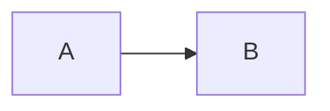

# Hype Documentation Tool

Hype is a content generation tool that extends Markdown with dynamic features for creating rich, automated documentation that stays in sync with your code.

## Core Principles

- **Packages**: Keep content in small, reusable units with relative links
- **Reuse**: Write documentation once, use everywhere (blog, book, README)
- **Includes**: Compose larger documents from smaller partials
- **Validation**: Verify code samples compile and run correctly
- **Asset validation**: Ensure local assets like images exist

## Tag Reference

### `<code>` - Display Source Code

Display source code from files with syntax highlighting.

```html
<!-- Entire file -->
<code src="main.go"></code>

<!-- Named snippet -->
<code src="main.go" snippet="example"></code>

<!-- Alternative snippet syntax -->
<code src="main.go#example"></code>

<!-- Line range (0-indexed) -->
<code src="main.go" range="10:20"></code>

<!-- Override language -->
<code src="config.txt" language="yaml"></code>

<!-- Escape HTML entities -->
<code src="template.html" esc></code>
```

### `<go>` - Execute Go Commands

Run Go commands and display output. Supports all `go` subcommands.

```html
<!-- Run a Go file -->
<go run="main.go"></go>

<!-- Run with source directory -->
<go src="myapp" run="."></go>

<!-- Build and show output -->
<go build="."></go>

<!-- Run tests -->
<go test="-v ./..."></go>

<!-- Show documentation for a symbol -->
<go doc="fmt.Println"></go>

<!-- Cross-compilation -->
<go build="." goos="linux" goarch="amd64"></go>

<!-- With environment variables -->
<go run="main.go" environ="DEBUG=true,LOG_LEVEL=info"></go>

<!-- Show code then run it -->
<go src="examples" code="main.go" run="."></go>

<!-- Expected non-zero exit -->
<go run="fail.go" exit="1"></go>

<!-- Custom timeout -->
<go run="slow.go" timeout="60s"></go>
```

### `<cmd>` - Execute Shell Commands

Run arbitrary shell commands and capture output.

```html
<!-- Simple command -->
<cmd exec="echo Hello World"></cmd>

<!-- Command in a directory -->
<cmd exec="ls -la" src="mydir"></cmd>

<!-- Expect failure -->
<cmd exec="false" exit="1"></cmd>

<!-- Any non-zero exit -->
<cmd exec="might-fail" exit="-1"></cmd>

<!-- With environment -->
<cmd exec="printenv FOO" environ="FOO=bar"></cmd>

<!-- Custom timeout (default 30s) -->
<cmd exec="long-process" timeout="120s"></cmd>

<!-- Stabilize dynamic output for reproducible documentation -->
<!-- Without this, regenerating docs creates diffs even when code hasn't changed -->
<cmd exec="go version"
     replace-1="go1\.\d+\.\d+"
     replace-1-with="goX.X.X">
</cmd>

<!-- Multiple replacements for timestamps, versions, UUIDs -->
<!-- Essential for blogs and READMEs you regenerate regularly -->
<cmd exec="./build.sh"
     replace-1="\d{4}-\d{2}-\d{2}"
     replace-1-with="[DATE]"
     replace-2="[0-9a-f]{8}-[0-9a-f]{4}-[0-9a-f]{4}-[0-9a-f]{4}-[0-9a-f]{12}"
     replace-2-with="[UUID]">
</cmd>
```

### `<include>` - Include Other Documents

Compose documents from partials.

```html
<!-- Include another markdown file -->
<include src="docs/intro.md"></include>

<!-- Include from subdirectory -->
<include src="chapters/getting-started/index.md"></include>
```

Included files maintain their relative paths for assets and links.

### `<youtube>` - Embed YouTube Videos

Embed YouTube videos in documentation.

```html
<!-- Basic embed -->
<youtube id="dQw4w9WgXcQ"></youtube>

<!-- With custom title -->
<youtube id="dQw4w9WgXcQ" title="Introduction Video"></youtube>
```

The `id` must be exactly 11 alphanumeric characters (the video ID from YouTube URLs).

### Mermaid Diagrams - ASCII Art Diagrams

Include [Mermaid](https://mermaid.js.org/) diagrams that render as ASCII art. Use standard fenced code blocks with the `mermaid` language:

    ```mermaid
    graph LR
        A[Start] --> B{Decision}
        B -->|Yes| C[Action]
        B -->|No| D[End]
    ```

This renders as ASCII art in both HTML and Markdown output:

```
┌──────────┐     ┌─────────────┐
│ A[Start] ├────►│ B{Decision} │
└──────────┘     └─────────────┘
```

**Supported diagram types:**
- Flowcharts/Graphs (`graph LR`, `graph TD`, `flowchart LR`, `flowchart TD`)
- Sequence diagrams (`sequenceDiagram`)

**Limitations:** Subgraphs, class diagrams, state diagrams, Gantt charts, and pie charts are not supported.

## Snippet System

Snippets let you extract specific portions of code files. Mark regions with comments:

### Go, JavaScript, TypeScript

```go
// snippet:example
func Example() {
    fmt.Println("This is the snippet content")
}
// snippet:example
```

### HTML, Markdown

```html
<!-- snippet:header -->
<header>Navigation here</header>
<!-- snippet:header -->
```

### Ruby, Shell, YAML

```yaml
# snippet:config
database:
  host: localhost
  port: 5432
# snippet:config
```

### Supported Extensions

| Extension | Comment Format |
|-----------|----------------|
| `.go` | `// snippet:name` |
| `.js`, `.ts` | `// snippet:name` |
| `.html`, `.md` | `<!-- snippet:name -->` |
| `.rb` | `# snippet:name` |
| `.sh` | `# snippet:name` |
| `.yaml`, `.yml` | `# snippet:name` |
| `.env`, `.envrc` | `# snippet:name` |

## CLI Commands

### Export to Markdown

```bash
# Generate README from hype document
hype export -format=markdown -f hype.md > README.md

# Export with custom output
hype export -format=markdown -f docs/guide.md -o output.md
```

### Export to HTML

```bash
# Export with default GitHub theme
hype export -format=html -f document.md > output.html

# Export with a specific theme
hype export -format=html -theme solarized-dark -f document.md -o output.html

# Use custom CSS
hype export -format=html -css ./my-styles.css -f document.md -o output.html

# Raw HTML without styling
hype export -format=html -no-css -f document.md

# List available themes
hype export -themes
```

**Built-in Themes:** `github` (default, auto light/dark), `github-dark`, `solarized-light`, `solarized-dark`, `swiss`, `air`, `retro`

| Flag | Description |
|------|-------------|
| `-theme <name>` | Select a built-in theme (default: `github`) |
| `-css <path>` | Use a custom CSS file (overrides -theme) |
| `-no-css` | Output raw HTML without styling |
| `-themes` | List available themes and exit |

### Live Preview

Start a live preview server with automatic file watching and browser reload:

```bash
# Basic preview
hype preview -f hype.md

# Auto-open browser
hype preview -f hype.md -open

# Different port
hype preview -f hype.md -port 8080

# Watch directories (include . to watch source file location)
hype preview -f hype.md -w . -w ./src -w ./images

# Filter by extensions
hype preview -f hype.md -e md,html,go,png

# Include/exclude patterns
hype preview -f hype.md -i "**/*.md" -x "**/vendor/**"

# Use a theme
hype preview -f hype.md -theme solarized-dark

# List themes
hype preview -themes
```

| Flag | Alias | Default | Description |
|------|-------|---------|-------------|
| `-f` | | `hype.md` | Source file to preview |
| `-port` | | `3000` | Server port |
| `-w` | `-watch` | | Directories to watch (repeatable) |
| `-e` | `-ext` | | File extensions to watch (comma-separated) |
| `-i` | `-include` | | Glob patterns to include (repeatable) |
| `-x` | `-exclude` | | Glob patterns to exclude (repeatable) |
| `-d` | `-debounce` | `300ms` | Debounce delay before rebuild |
| `-v` | `-verbose` | `false` | Log file changes |
| `-open` | | `false` | Auto-open browser |
| `-theme` | | `github` | Preview theme |
| `-css` | | | Custom CSS file |
| `-themes` | | | List themes and exit |
| `-timeout` | | `0` | Execution timeout |

### Blog Generator

Create static blogs with code execution:

```bash
# Create new blog
hype blog init mysite
cd mysite

# Create article
hype blog new hello-world

# Build and serve
hype blog build
hype blog serve

# Live reload during development
hype blog serve --watch

# Theme management
hype blog theme list
hype blog theme add developer
```

**Built-in Blog Themes:** `suspended` (minimal), `developer` (terminal-style), `cards` (grid layout)

For full blog documentation, see [blog/README.md](https://github.com/gopherguides/hype/blob/main/blog/README.md).

## Code Block Handling

Hype follows [CommonMark](https://spec.commonmark.org/) semantics for code blocks:

### Inline vs Block Code

- **Inline code** (single-line): Rendered with backticks `` `code` ``
- **Block code** (multi-line or with language attribute): Rendered as fenced code blocks

The routing happens at parse time based on content and attributes.

### Showing Code Block Examples in Documentation

When you need to show fenced code block syntax as an example (like documenting how to use mermaid), use **4-space indentation** in your source markdown:

        ```mermaid
        graph LR
            A --> B
        ```

Hype outputs this using **tilde fences** (`~~~`) to avoid conflicts with the backticks in the content:

```
~~~plain

~~~
```

This follows CommonMark best practice: tildes and backticks ignore each other, so a tilde fence can safely contain content with triple backticks.

### Inline Code with Backticks

For inline code containing backticks, Hype uses more backticks to escape:

| Content | Output |
|---------|--------|
| `var x = 1` | `` `var x = 1` `` |
| Use `` `fmt.Println` `` | ```` `` Use `fmt.Println` `` ```` |
| Has ``` `` ``` double | ````` ``` Has `` double ``` ````` |

## Best Practices

### Directory Structure

```
project/
├── .hype/
│   ├── hype.md           # Main document
│   └── docs/
│       ├── intro.md
│       ├── examples/
│       │   ├── basic.go
│       │   └── advanced.go
│       └── images/
│           └── diagram.png
├── README.md             # Generated output
└── src/
    └── ...
```

### Document Organization

1. Use `<include>` to break large documents into manageable pieces
2. Keep code examples in dedicated directories near your documentation
3. Use snippets to show relevant portions of larger files
4. Set appropriate timeouts for slow-running commands
5. Use `exit` attribute when demonstrating error cases

### Code Examples

1. Always test that code examples compile/run before documenting
2. Use snippets to keep examples focused and maintainable
3. Include enough context for examples to be understandable
4. Use `code` attribute on `<go>` tags to show source before output

## Error Handling

### Common Errors

| Error | Cause | Solution |
|-------|-------|----------|
| `missing src attribute` | `<code>` or `<include>` without `src` | Add `src="path/to/file"` attribute |
| `unclosed snippet` | Snippet comment not closed | Add closing `// snippet:name` comment |
| `snippet not found` | Referenced snippet doesn't exist | Check snippet name matches exactly |
| `duplicate snippet` | Same snippet name used twice | Use unique names for each snippet |
| `invalid YouTube video ID` | ID not 11 alphanumeric chars | Use valid 11-char video ID |
| `exit code mismatch` | Command exit differs from expected | Set correct `exit` attribute or fix command |
| `timeout exceeded` | Command took too long | Increase `timeout` or optimize command |

### Debugging Tips

1. Run `hype export` with verbose output to see processing steps
2. Check that all source files exist and are readable
3. Verify snippet names match exactly (case-sensitive)
4. Test commands manually before adding to documentation

## File References

For complete attribute details, see:
- [Tag Reference](references/tag-reference.md) - All attributes for each tag
- [Troubleshooting](references/troubleshooting.md) - Common errors and solutions
