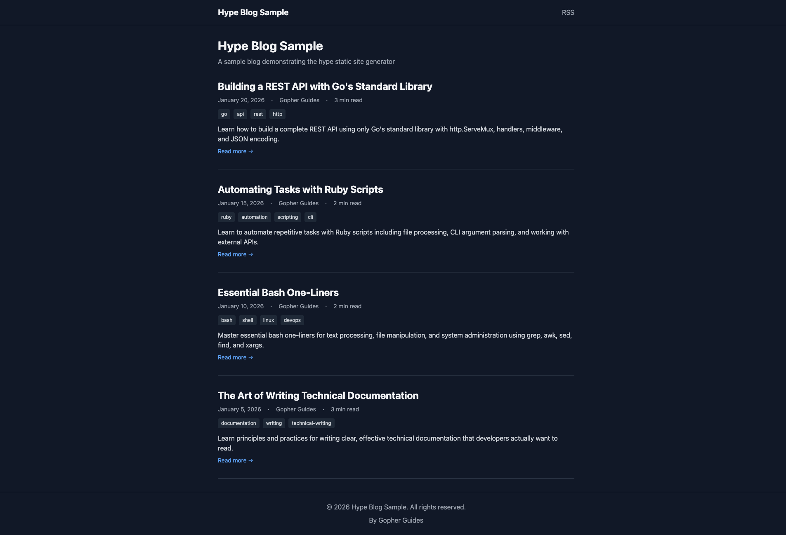
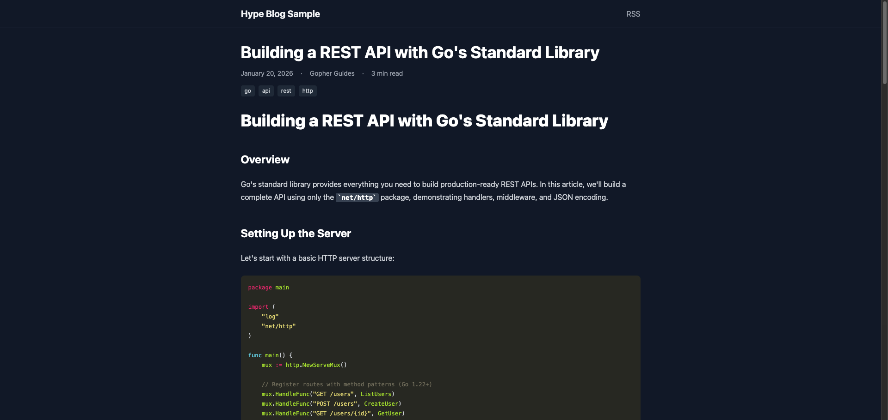
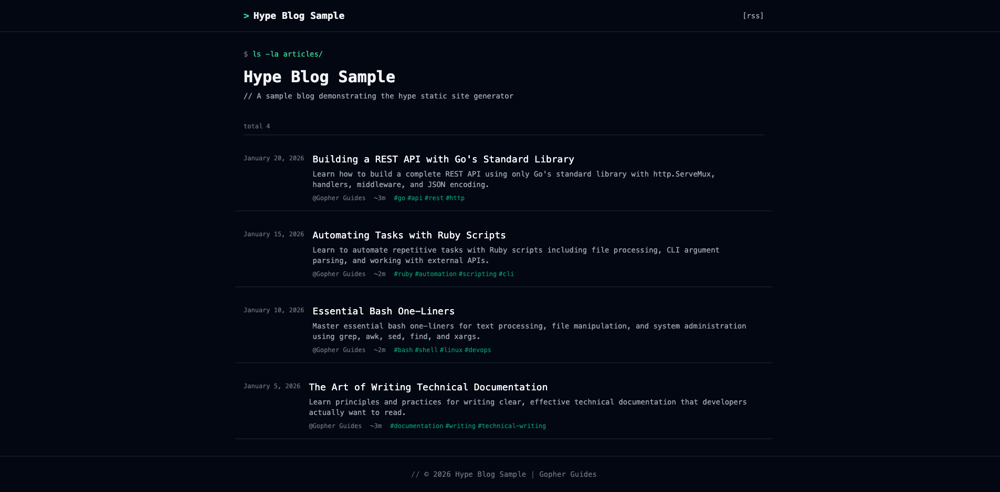
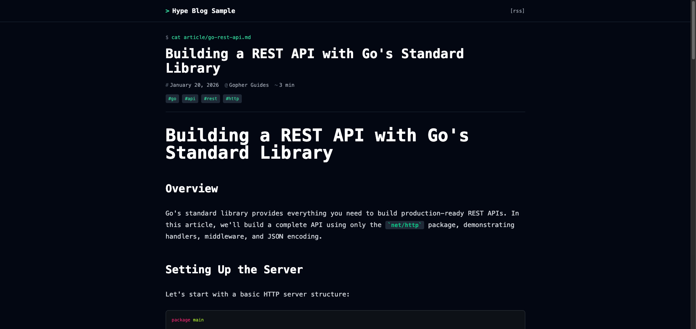
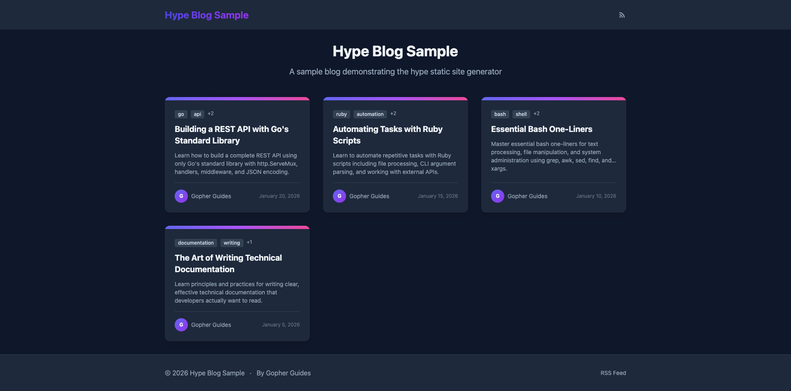
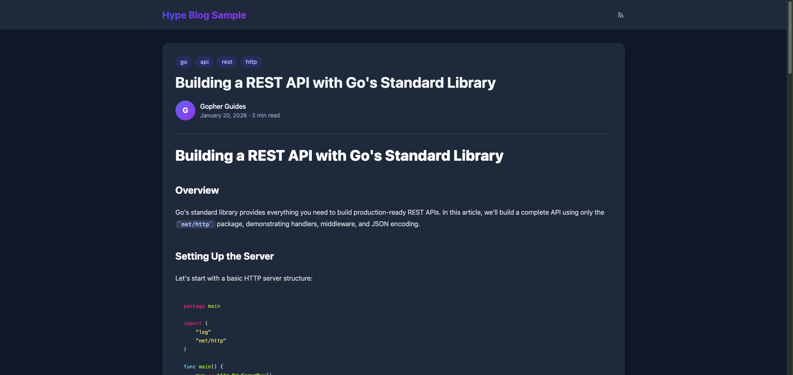

# Hype Blog Generator

The hype blog generator creates static sites from markdown content with code execution, syntax highlighting, and theme support.

## Quick Start

```bash
# Create a new blog
hype blog init mysite

# Create an article
cd mysite
hype blog new hello-world

# Build the site
hype blog build

# Preview locally
hype blog serve
```

## Commands

| Command | Description |
|---------|-------------|
| `hype blog init <name>` | Create a new blog project |
| `hype blog new <slug>` | Create a new article |
| `hype blog build` | Build the static site |
| `hype blog serve` | Start local preview server |
| `hype blog theme list` | List available themes |
| `hype blog theme add <name>` | Add a theme to your project |

## Themes

Hype Blog includes three built-in themes. Templates live in your project's `themes/` directory, giving you full customization control.

### Suspended (Default)

A minimal, typography-focused theme perfect for technical writing.

**Home Page:**


**Article Page:**


**Features:**
- Clean typography with generous whitespace
- System font stack for fast loading
- Dark/light mode (follows system preference)
- Minimal navigation
- Reading time display

### Developer

A dark, terminal-inspired theme for code-heavy blogs.

**Home Page:**


**Article Page:**


**Features:**
- Dark background by default
- Monospace font throughout
- Terminal-style prompts (`$ cat article/...`)
- Green accent color
- `ls -la` style article listing
- Enhanced code block styling

### Cards

A modern card-based layout with visual hierarchy.

**Home Page:**


**Article Page:**


**Features:**
- Grid layout for article cards
- Colorful gradient accents
- Author avatars
- Tag chips
- Shadow and hover effects
- Great for visual/image-rich blogs

## Using Themes

### Initialize with a Theme

```bash
# Use default (suspended) theme
hype blog init mysite

# Use a specific theme
hype blog init --theme developer mysite
hype blog init --theme cards mysite
```

### Switch Themes

1. Add the theme to your project:
   ```bash
   hype blog theme add developer
   ```

2. Update `config.yaml`:
   ```yaml
   theme: "developer"
   ```

3. Rebuild:
   ```bash
   hype blog build
   ```

### Use a Theme from Git

```bash
hype blog init --theme https://github.com/user/hype-theme-custom mysite
```

## Customizing Themes

### Template Lookup Order

Templates are loaded in this order (first match wins):

1. `layouts/` - Your project overrides (highest priority)
2. `themes/<theme>/layouts/` - Theme templates
3. Built-in defaults (fallback)

### Override a Single Partial

You don't need to copy the entire theme to customize it. Just override the specific file:

```bash
# Copy just the header partial
mkdir -p layouts/partials
cp themes/suspended/layouts/partials/header.html layouts/partials/

# Edit your custom header
vim layouts/partials/header.html
```

Your `layouts/partials/header.html` will be used instead of the theme's version.

### Theme Structure

```
themes/suspended/
├── theme.yaml              # Theme metadata
├── layouts/
│   ├── _default/
│   │   ├── baseof.html     # Base template
│   │   ├── single.html     # Article page
│   │   └── list.html       # Home/list page
│   ├── partials/
│   │   ├── head.html       # <head> content
│   │   ├── header.html     # Site header
│   │   ├── footer.html     # Site footer
│   │   ├── seo.html        # SEO meta tags
│   │   ├── styles.html     # CSS/Tailwind
│   │   └── scripts.html    # JavaScript
│   ├── rss.xml
│   └── sitemap.xml
└── static/                 # Theme static assets
```

## Project Structure

```
mysite/
├── config.yaml             # Site configuration
├── content/                # Your articles
│   └── my-article/
│       ├── module.md       # Article content
│       └── src/            # Code files
├── layouts/                # Your template overrides
├── themes/                 # Installed themes
│   └── suspended/
├── static/                 # Your static files
│   └── favicon.svg
└── public/                 # Generated output
```

## Configuration

Example `config.yaml`:

```yaml
title: "My Blog"
description: "A blog about Go programming"
baseURL: "https://myblog.com"
author:
  name: "Your Name"
  email: "you@example.com"
  twitter: "@yourhandle"
theme: "suspended"
highlight:
  style: "monokai"
  lineNumbers: false
seo:
  ogImage: "/images/og-default.png"
  twitterCard: "summary_large_image"
contentDir: "content"
outputDir: "public"
```

## Article Frontmatter

Articles use a `<details>` block for metadata:

```markdown
# My Article Title

<details>
slug: my-article
published: 01/25/2026
author: Your Name
seo_description: Brief description for SEO (150-160 chars)
tags: go, tutorial, api
</details>

Your article content here...
```

## Live Reload

Use the `--watch` flag for automatic rebuilds:

```bash
hype blog serve --watch
```

Changes to content, templates, or config will trigger a rebuild.
