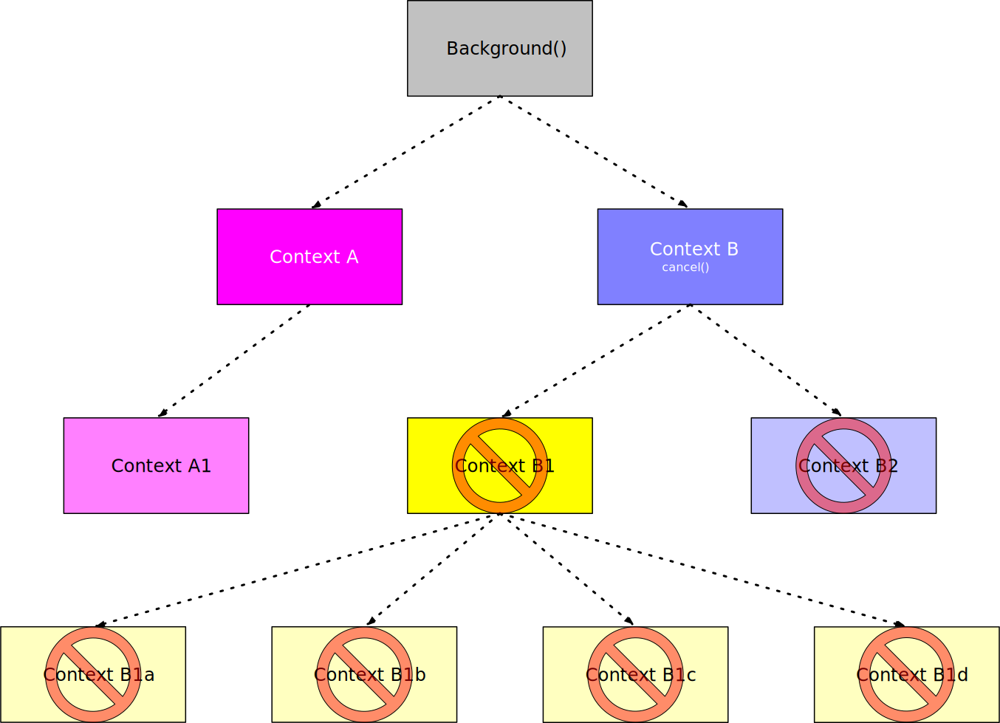

# Cancellation Propagation with Contexts

While having the ability to pass contextual information via the <godoc>context#Context</godoc> is useful, the real benefit, and design of the <godoc>context</godoc> package, is that it can be used to propagate cancellation events to those listening to the context. When a parent <godoc>context#Context</godoc> is canceled, all its children are also canceled.

## Creating a Cancellable Context

In order to cancel a <godoc>context#Context</godoc>, we must have a way of cancelling it. The <godoc>context#WithCancel</godoc> function, <ref>withcancel.doc</ref>, wraps a given <godoc>context#Context</godoc> with a <godoc>context#Context</godoc> that can be cancelled.

<figure id="withcancel.doc" type="listing">

<go doc="context.WithCancel"></go>

<figcaption>The <godoc>context#WithCancel</godoc> function.</figcaption>
</figure>

The <godoc>context#WithCancel</godoc> function returns a second argument, that of a <godoc>context#CancelFunc</godoc> function, which can be used to cancel the <godoc>context#Context</godoc>.

### The Cancel Function

There a few things that need to be noted about the <godoc>context#CancelFunc</godoc> function, <ref>cancelfunc.doc</ref>. So let's examine each in more detail.

<figure id="cancelfunc.doc" type="listing">

<go doc="context.CancelFunc"></go>

<figcaption>The <godoc>context#CancelFunc</godoc> function.</figcaption>
</figure>

#### Idempotent Behavior

> "After the first call, subsequent calls to a CancelFunc do nothing".

According to the <godoc>context#CancelFunc</godoc> documentation, the <godoc>context#CancelFunc</godoc> function is [idempotent](https://en.wikipedia.org/wiki/Idempotence), <ref>idempotent</ref>. That is, calling it multiple times has no effect beyond the first call.

<figure id="idempotent" type="listing">

```go
ctx, cancel := context.WithCancel(context.Background())
cancel() // cancels the context
cancel() // has no effect
cancel() // has no effect
```

<figcaption>The idempotent behavior of the <godoc>context#CancelFunc</godoc> function.</figcaption>
</figure>

#### Leaking Resources

> "Canceling this context releases resources associated with it, so code should call cancel as soon as the operations running in this Context complete."

Often you will want to defer execution of the <godoc>context#CancelFunc</godoc> function until the function, or application, exits. This ensure proper shutdown of the <godoc>context#Context</godoc> and prevents the <godoc>context#Context</godoc> from leaking resources.

<figure id="leaking" type="listing">

```go
ctx, cancel := context.WithCancel(context.Background())
// ensure the cancel function is called at least once
// to avoid leaking resources
defer cancel()
```

<figcaption>Prevent leaking goroutines by calling the <godoc>context#CancelFunc</godoc></figcaption>
</figure>

> **ALWAYS** call the <godoc>context#CancelFunc</godoc> function when you no longer need the <godoc>context#Context</godoc>. Failure to do so may cause your program to leak resources.

## Cancelling a Context

Consider <ref>basic.listener</ref>. The `listener` function takes a <godoc>context#Context</godoc> as its first argument and an `int` representing the goroutine id as its second argument.

The `listener` function will block until the <godoc>context#Context</godoc> is cancelled, which close the channel behind <godoc>context#Context.Done</godoc> method. This will unblock the `listener` function and allow it to exit.

<figure id="basic.listener" type="listing">
<code src="src/basic/main.go#listener"></code>
<figcaption>Blocking on <godoc>context#Context.Done</godoc>.</figcaption>
</figure>

wThe application creates a <godoc>context#Background</godoc> context and then wraps it with a cancellable <godoc>context#Context</godoc>. The <godoc>context#CancelFunc</godoc> returned by is immediately deferred to ensure the application doesn't leak any resources.

In <ref>basic.main</ref> we create several goroutines that will listen for the <godoc>context#Context</godoc> to be cancelled.

<figure id="basic.main" type="listing">
<code src="src/basic/main.go#main"></code>
<figcaption>Using context cancellation.</figcaption>
</figure>

As we can see from the output, <ref>basic.out</ref>, the `listener` function unblocks and exits when the <godoc>context#CancelFunc</godoc> is called, `cancel()`.

<figure id="basic.out" type="listing">

<go run="main.go" src="./src/basic"></go>

<figcaption>The output of the application.</figcaption>
</figure>

### Only Child Nodes of the Context are Cancelled

The illustration in <ref>cancellation.svg</ref> shows that by cancelling a node in the hierarchy, all its child nodes are also cancelled. Other nodes, such as parent and sibling nodes, in the hierarchy are unaffected.

<figure id="cancellation.svg" type="listing">



<figcaption>Cancellation propagation.</figcaption>
</figure>

## Listening for Cancellation Confirmation

Previously, we have use <godoc>time#Sleep</godoc> to block the execution of the program. This is not a good practice, as it can lead to deadlocks and other problems. Instead, the application should receive a <godoc>context#Context</godoc> cancellation confirmation.

### Starting a Concurrent Monitor

Consider <ref>cancelling.start</ref>. To start a `Monitor` we must use the `Start` method giving it a <godoc>context#Context</godoc>. In return, the `Start` method returns a <godoc>context#Context</godoc> that can be listened to by the application to confirm the shutdown of the `Monitor` later on.

<figure id="cancelling.start" type="listing">
<code src="src/cancelling/main.go#start"></code>
<figcaption>Accepting a <godoc>context#Context</godoc> and returning a new one.</figcaption>
</figure>

To prevent the application from blocking, we launch a the `listen` method in a goroutine with the given <godoc>context#Context</godoc>. Unless this <godoc>context#Context</godoc> is cancelled, the `listen` method will never stop and will continue to leak resources until the application exits.

The <godoc>context#CancelFunc</godoc> is held onto by the `Manager` so when the `Manager` is told to cancel by the client, it will also cancel the `Monitor` context. This will tell the client that the `Monitor` has been shutdown, confirming the cancellation of the `Monitor`.

### Monitor Checking

The `listen` method will block until the given <godoc>context#Context</godoc>, given by the application, is cancelled, <ref>cancelling.listen</ref>. We first make sure to defer the <godoc>context#CancelFunc</godoc> in the `Monitor` to ensure that if any the `listen` method exits for any reason, clients will be notified that the `Monitor` has been shutdown.

<figure id="cancelling.listen" type="listing">
<code src="src/cancelling/main.go#listen"></code>
<figcaption>the `Monitor` will call its <godoc>context#CancelFunc</godoc> if external <godoc>context#Context</godoc> is cancelled.</figcaption>
</figure>

### Using the Cancellation Confirmation

In <ref>cancelling.main</ref>, the application starts with a <godoc>context#Background</godoc> context and then wraps that with a cancellable <godoc>context#Context</godoc>. The <godoc>context#CancelFunc</godoc> returned by is immediately deferred to ensure the application doesn't leak any resources. After a short while, in a goroutine, the `cancel` function is called, the <godoc>context#Context</godoc> is cancelled.

The `Monitor` is then started our cancellable <godoc>context#Context</godoc>. The <godoc>context#Context</godoc> returned by the `Start` method is listened to by the application. When the `Monitor` is cancelled, the application will be unblocked and can exit. Alternatively, if the application is still running after a couple of seconds the application is forcibly terminated.

<figure id="cancelling.main" type="listing">
<code src="src/cancelling/main.go#main"></code>
<figcaption>Using the cancellation confirmation.</figcaption>
</figure>

As we can see from the output, in <ref>cancelling.out</ref>, the application waits for the `Monitor` to properly shutdown before exiting. We were also able to remove the use of <godoc>time#Sleep</godoc> to allow the monitor to finish.

<figure id="cancelling.out" type="listing">
<go run="main.go" src="./src/cancelling"></go>
<figcaption>The output of the application.</figcaption>
</figure>
