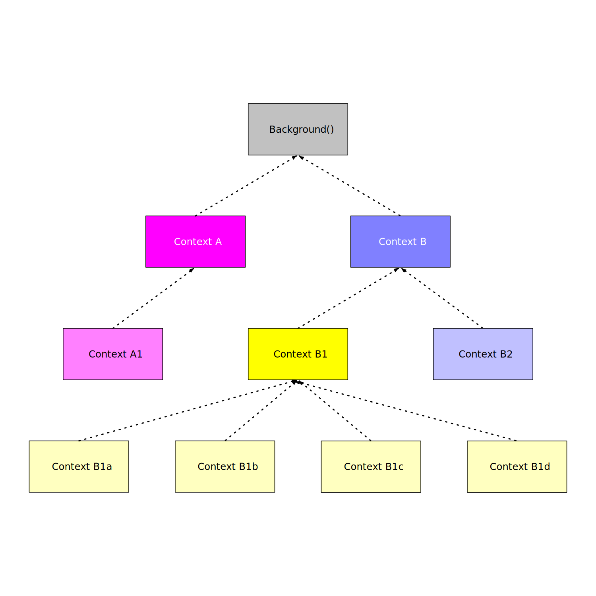

# Context Nodal Hierarchy

As the <godoc>context</godoc> documentation states, a <godoc>context#Context</godoc> is not meant to be stored and held onto, but should be passed at "runtime".

Consider an HTTP request. An HTTP request is a **runtime** value that gets passed along through the application until eventually the response is returned. We would not want to store, or hold on to, the request for future use as it would be of no benefit once the response is returned.

Using <godoc>context#Context</godoc> in our code behaves like the HTTP request. We pass a <godoc>context#Context</godoc> through the application where they can be listened to for cancellation, or for other purposes, at "runtime".

As a <godoc>context#Context</godoc> is passed through the application, a receiving method may wrap the context with their cancellation functionality or with <godoc>context#WithValue</godoc> to add a value, such as a "request id", before passing the <godoc>context#Context</godoc> along to any functions, or methods, that it may call.

The result is a nodal hierarchy of <godoc>context#Context</godoc> values that starts at the beginning of the request, or the start of the application, and spiders out throughout the application.

## Understanding the Nodal Hierarchy

Consider <ref>tree</ref>. We start with a <godoc>context#Background</godoc> context and pass it the `A` and `B` functions. Each function wraps the given <godoc>context#Context</godoc>, prints that new <godoc>context#Context</godoc> with a new one before either passing it along to the next function or returning.

<figure id="tree" type="listing">
<code src="src/node-tree/main.go#main"></code>
<figcaption>Wrapping contexts creates nodal hierarchies.</figcaption>
</figure>

## Wrapping with Context Values

To wrap the <godoc>context#Context</godoc> with a new one, we will use <godoc>context#WithValue</godoc>. The <godoc>context#WithValue</godoc> function takes a <godoc>context#Context</godoc> and a key and value, and returns a new <godoc>context#Context</godoc> with the given key and value that wraps the original <godoc>context#Context</godoc>. We will learn more about <godoc>context#WithValue</godoc> later.

## Following the Context Nodes

In <ref>example</ref>, we define the functions used in <ref>tree</ref>. Each of these functions takes a <godoc>context#Context</godoc> as an argument. They then wrap the <godoc>context#Context</godoc> with a new one, print the new <godoc>context#Context</godoc> with a new one, and pass it along to the next function.

<figure id="example" type="listing">
<code src="src/node-tree/main.go#example"></code>
<figcaption>The example application.</figcaption>
</figure>

When we look at the output of the program, <ref>out</ref>, we can see that when we print out any given <godoc>context#Context</godoc> we see that is at the bottom of the node tree and the <godoc>context#Background</godoc> context is at the top of the node tree hierarchy.

<figure id="out" type="listing">

<go run="main.go" src="src/node-tree"></go>

<figcaption>Printing the node tree.</figcaption>
</figure>

In <ref>example-tree</ref>, we see that the `B1a` <godoc>context#Context</godoc> is a child of the `B1` <godoc>context#Context</godoc> and the `B1` <godoc>context#Context</godoc> is a child of the `B` <godoc>context#Context</godoc> and the `B` <godoc>context#Context</godoc> is a child of the original background <godoc>context#Context</godoc>.

<figure id="example-tree" type="listing">

<figcaption>Visualizing the node tree.</figcaption>
</figure>
